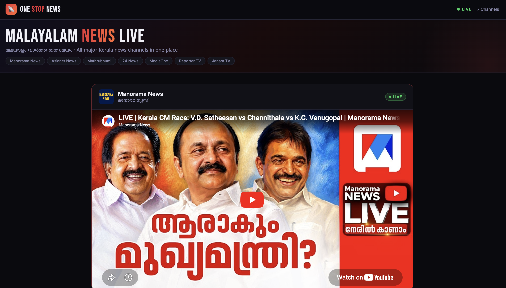

# One Stop News

A simple Malayalam live news streaming website that brings multiple popular Kerala news channels together in one place. Built using pure HTML, CSS, and embedded YouTube live streams.  [oai_citation:0‡index.html](sediment://file_00000000d04c7207a066b19956eb7fea)

## Features

- Live Malayalam news channels in one page
- Responsive modern UI
- Dark-themed design
- Smooth scrolling navigation
- Sticky header
- Mobile-friendly layout
- Embedded YouTube live streams

## Channels Included

- Manorama News
- Asianet News
- Mathrubhumi News
- 24 News
- MediaOne TV
- Reporter TV
- Janam TV

## Tech Stack

- HTML5
- CSS3
- JavaScript

## Project Type

Static frontend project with embedded live news streams.

```bash
https://vais-hnav.github.io/one-stop-news/
```


## How to Run

1. Download or clone the repository

```bash
git clone https://github.com/vais-hnav/one-stop-news.git
```

2. Open the project folder

```bash
cd YOUR_REPOSITORY
```

3. Open `index.html` in your browser

No installation or dependencies required.

## Deployment

This project can be deployed easily using GitHub Pages.

### GitHub Pages Setup

1. Push project to GitHub
2. Open repository settings
3. Go to `Pages`
4. Select:
   - Source → Deploy from branch
   - Branch → main
5. Save

Your website will be live at:

```bash
https://YOUR_USERNAME.github.io/YOUR_REPOSITORY/
```

## Screenshot



## Author

Vaishnav P

## License

This project is for educational and personal use.